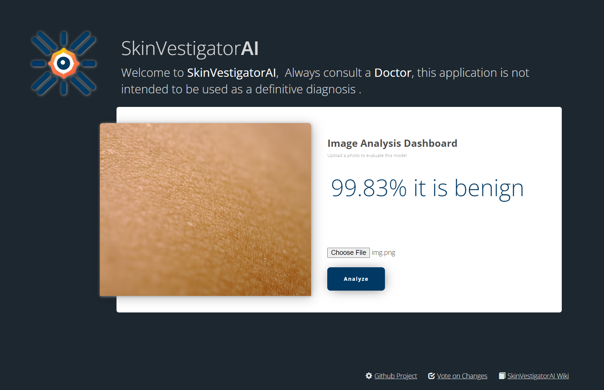

# SkinVestigatorAI [](https://skinvestigator-thomasbehan4.b4a.run/) []
  
> SkinVestigatorAI is an open-source project for deep learning-based skin cancer detection. It aims to create a reliable tool and foster community involvement in critical AI problems. The repository includes code for data preprocessing, model building, and performance evaluation. Contribute and shape the future of skin cancer detection.

## Table of Contents
- [Getting Started](#getting-started)
- [Data](#data)
- [Model](#model)
- [Performance](#performance)
- [Contributing](#contributing)
- [License](#license)
- [References](#references)
- [Citation](#citation)
- [Disclaimer](#disclaimer)

# Getting Started


These instructions will get you a copy of the project up and running on your local machine for development and testing purposes. See [deployment](#deployment) for notes on how to deploy the project on a live system.

## Running the Application with Docker and Docker Compose

### Prerequisites

- Docker: [Install Docker](https://docs.docker.com/get-docker/)
- Docker Compose: [Install Docker Compose](https://docs.docker.com/compose/install/)
- NVIDIA drivers and NVIDIA Container Toolkit (only required for GPU support): [Install NVIDIA Docker](https://docs.nvidia.com/datacenter/cloud-native/container-toolkit/install-guide.html)
- Download Pretrained Model: Put the latest h5 file in the models folder [Download Model](https://github.com/Thomasbehan/SkinVestigatorAI/releases)

### Steps

1. Clone the repository:
    ```bash
    git clone https://github.com/Thomasbehan/SkinVestigatorAI.git
    cd SkinVestigatorAI
    ```
2. Build the Docker image:
    ```bash
    docker-compose build
    ```

3. Run the application using Docker Compose:
    ```bash
    docker-compose up
    ```

4. Access the application in your web browser by navigating to:
    ```bash
    http://localhost:6543
    ```

5. To stop the application, press Ctrl+C in the terminal where you ran docker-compose up.

6. (Optional) If you need to remove the containers, networks, and volumes defined in docker-compose.yml, run:
    ```bash
    docker-compose down --remove-orphans --volumes
    ```


## Running the Application without Docker

### Prerequisites
- Python 3.9+

### Installing
1. Clone the repository
    ```bash
    git clone https://github.com/Thomasbehan/SkinVestigatorAI.git
    ```
2. Change directory into your newly created project if not already there. Your current directory should be the same as this README.txt file and setup.py.
    ```bash
    cd SkinVestigatorAI
    ```
3. Create a Python virtual environment, if not already created.
    ```bash
    python3 -m venv env
    ```
4. Upgrade packaging tools, if necessary.
    ```bash
    env/bin/pip install --upgrade pip setuptools
    ```
5. Install the project in editable mode with its testing requirements.
    ```bash
    env/bin/pip install -e ".[testing]"
    ```
6. Run your project's tests.
    ```bash
    env/bin/pytest
    ```
7. Run your project.
    ```bash
    env/bin/pserve development.ini
    ```

## Running the Application If you have an Apple Silicon arm64 CPU
1. Clone the repository:
    ```bash
    git clone https://github.com/Thomasbehan/SkinVestigatorAI.git
    cd SkinVestigatorAI
    ```
2. Download the latest version of Conda for Apple Silicon from [here](https://repo.anaconda.com/miniconda/Miniconda3-latest-MacOSX-arm64.sh)

3. using that shell script, install miniconda3
   ```bash
   bash ~/miniconda.sh -b -p $HOME/miniconda
   ```
   
4. Activate the conda environment
   ```bash
   source ~/miniconda/bin/activate
   ```

5. Install apple and tensorflow-deps packages
   ```bash
   conda install -c apple tensorflow-deps
   ```

6. Install tensorflow
   ```bash
   python -m pip install tensorflow
   ```
   
7. Install tensorflow-metal
   ```bash  
   python -m pip install tensorflow-metal
   ```

8. Upgrade packaging tools, if necessary.
    ```bash
    python -m pip install --upgrade pip setuptools
    ```
   
9. Install the project in editable mode with its testing requirements.
    ```bash
    python -m pip install -e ".[testing]"
    ```
   
10. Run your project's tests.
     ```bash
     python -m pytest
     ```
    
11. Run your project.
     ```bash
     python -m pserve development.ini --reload
     ```

## Running the Tests and Linting
[](https://github.com/Thomasbehan/SkinVestigatorAI/actions)

### Running the Tests
To run the tests, run the following command:
```bash
docker exec -ti skinvestigatorai-app-1 python3.9 -m pytest
```

### Running the Linter
To run the linter, run the following command:
```bash
docker exec -ti skinvestigatorai-app-1 python3.9 -m ruff --format=github --target-version=py39 .
```

## Data
The DataScraper tool within this application is designed to download and preprocess skin lesion images from the ISIC Archive for use in machine learning projects. The images are stored in three separate directories for training, validation, and testing.

### Data Source
The data is fetched from the ISIC Archive using their API. The base URL for the API is https://api.isic-archive.com/api/v2. The code makes use of the /images/ endpoint to fetch a list of images in JSON format. Each image's metadata contains information about the image, including its URL, ISIC ID, and clinical information (benign/malignant).

### Data Organization
The images are organized into three folders:

1. data/train: Contains 70% of the total images for each batch, which can be used for training a model.
2. data/validation: Contains 20% of the total images for each batch, which can be used for model validation.
3. data/test: Contains the remaining 10% of the total images for each batch, which can be used for model testing.
Each folder is further organized into subfolders, separating the images based on their clinical classification (benign or malignant).

## Model
The model is a convolutional neural network (CNN) that uses transfer learning to classify skin lesion images as benign or malignant. The model is built using the Keras API and is trained using the TensorFlow backend. The model is trained using the Adam optimizer and the binary cross-entropy loss function.
Here is a summary of the model architecture:

    Model: "sequential_1"
    _________________________________________________________________
    Layer (type)                 Output Shape              Param #   
    =================================================================
    conv2d_1 (Conv2D)            (None, 224, 224, 32)      896       
    _________________________________________________________________
    max_pooling2d_1 (MaxPooling2 (None, 112, 112, 32)      0         
    _________________________________________________________________
    conv2d_2 (Conv2D)            (None, 112, 112, 64)      18496     
    _________________________________________________________________
    max_pooling2d_2 (MaxPooling2 (None, 56, 56, 64)        0         
    _________________________________________________________________
    conv2d_3 (Conv2D)            (None, 56, 56, 128)       73856     
    _________________________________________________________________
    max_pooling2d_3 (MaxPooling2 (None, 28, 28, 128)       0         
    _________________________________________________________________
    conv2d_4 (Conv2D)            (None, 28, 28, 128)       147584    
    _________________________________________________________________
    max_pooling2d_4 (MaxPooling2 (None, 14, 14, 128)       0         
    _________________________________________________________________
    flatten_1 (Flatten)          (None, 25088)             0         
    _________________________________________________________________
    dense_1 (Dense)              (None, 512)               12845568  
    _________________________________________________________________
    dense_2 (Dense)              (None, 1)                 513       
    =================================================================
    Total params: 13,053,313
    Trainable params: 13,053,313
    Non-trainable params: 0
    _________________________________________________________________

## Performance
The model achieved an accuracy of 91% and a loss of 22% on the testing dataset.
 

## Contributing
Please read [CONTRIBUTING.md](CONTRIBUTING.md) for details on our code of conduct, and the process for submitting pull requests to us.

## License
This project is licensed under the GNU General Public License v3.0 - see the [LICENSE.md](LICENSE.md) file for details

## Acknowledgments

## References

## Citation

## Disclaimer
This project is not intended to be used as a medical diagnostic tool. The authors of this project are not medical professionals and are not responsible for any medical decisions made by users of this project.
Always consult a medical professional for any medical concerns.