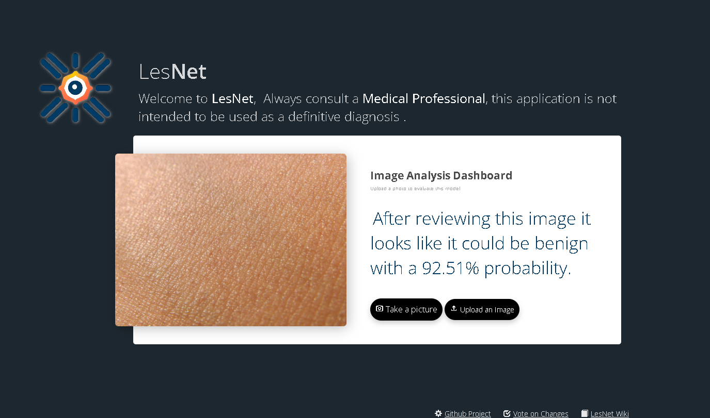

# SkinVestigatorAI  


 [](https://github.com/Thomasbehan/SkinVestigatorAI/actions)
[](https://github.com/Thomasbehan/SkinVestigatorAI/actions)

> SkinVestigatorAI is an open-source project for deep learning-based skin cancer detection. It aims to create a reliable tool and foster community involvement in critical AI problems. The repository includes code for data preprocessing, model building, and performance evaluation. Contribute and shape the future of skin cancer detection.

[](https://skinvestigator.onrender.com/) 

<sub><i>Please note that the application enters a dormant state when not in use to conserve resources. This means it might take a moment to warm up when you first access the site. Any initial slow down will ease after a moment. Thank you for your patience.
</i></sub>

## Table of Contents
- [Getting Started](#getting-started)
- [Data](#data)
- [Model](#model)
- [Performance](#performance)
- [Contributing](#contributing)
- [License](#license)
- [References](#references)
- [Citation](#citation)
- [Disclaimer](#disclaimer)

# Getting Started


These instructions will help you set up the project on your local machine for development and testing purposes. See [deployment](#deployment) for notes on deploying the project on a live system.

## Quick Setup for Development

To quickly set up SkinVestigatorAI for development, follow these steps
(Requires Python >=3.11):

1. **Upgrade Your Packaging Tools:**
   Ensure your `pip` and `setuptools` are up-to-date by running:
   ```bash
   python -m pip install --upgrade pip setuptools
   ```

2. **Install SkinVestigatorAI:**
   In the project directory, install the project in editable mode with:
   ```bash
   python -m pip install -e .
   ```
   
3. **Run the Application:**
   Start the application with auto-reloading using:
   ```bash
   pserve development.ini --reload
   ```

## Running the Tests and Linting
[](https://github.com/Thomasbehan/SkinVestigatorAI/actions)
[](https://github.com/Thomasbehan/SkinVestigatorAI/actions)

### Running the Tests
To run the tests, run the following command:
```bash
python -m pytest
```

### Running the Linter
To run the linter, run the following command:
```bash
python -m ruff --format=github --target-version=py311 .
```

## Data
The DataScraper tool within this application is designed to download and preprocess skin lesion images from the ISIC Archive for use in machine learning projects. The images are stored in three separate directories for training, validation, and testing.
The data is organised as follows:
- Train: 5625 benign, 5152 malignant

### Data Source
The data is fetched from the ISIC Archive using their API. The base URL for the API is https://api.isic-archive.com/api/v2. The code makes use of the /images/ endpoint to fetch a list of images in JSON format. Each image's metadata contains information about the image, including its URL, ISIC ID, and clinical information (benign/malignant).

### Data Organization
The images are organized into three folders:

1. data/train: Contains 70% of the total images for each batch, which can be used for training a model.
2. data/validation: Contains 20% of the total images for each batch, which can be used for model validation.
3. data/test: Contains the remaining 10% of the total images for each batch, which can be used for model testing.
Each folder is further organized into subfolders, separating the images based on their clinical classification (benign or malignant).

## Model
The model is a convolutional neural network (CNN) that uses transfer learning with the Vision Transformer (ViT) model to classify skin lesion images as benign or malignant. The model is trained using the Adam optimizer and the binary cross-entropy loss function.
Here is a summary of the model architecture:

    Model: "sequential"
      _________________________________________________________________
      Layer (type)                Output Shape              Param #
      =================================================================
       vit-b32 (Functional)        (None, 768)               87429888
      
       flatten (Flatten)           (None, 768)               0
      
       batch_normalization (BatchN  (None, 768)              3072
       ormalization)
      
       dense (Dense)               (None, 1024)              787456
      
       batch_normalization_1 (Batc  (None, 1024)             4096
       hNormalization)
      
       dropout (Dropout)           (None, 1024)              0
      
       dense_1 (Dense)             (None, 2)                 2050
      
      =================================================================
      Total params: 88,226,562
      Trainable params: 88,222,978
      Non-trainable params: 3,584
      _________________________________________________________________

## Performance
The model achieved an accuracy of 84% and a loss of 0.23 on the testing dataset.
We also track sensitivity, specificity, precision, and F1 score. The model achieved a sensitivity of 84%, a specificity of 84%, a precision of 84%, and an F1 score of 84.4% on the testing dataset.


## Contributing
Please read [CONTRIBUTING.md](CONTRIBUTING.md) for details on our code of conduct, and the process for submitting pull requests to us.

## License
This project is licensed under the GNU General Public License v3.0 - see the [LICENSE.md](LICENSE.md) file for details

## Acknowledgments

## References

## Citation

## Disclaimer
This project is not intended to be used as a medical diagnostic tool. The authors of this project are not medical professionals and are not responsible for any medical decisions made by users of this project.
Always consult a medical professional for any medical concerns.